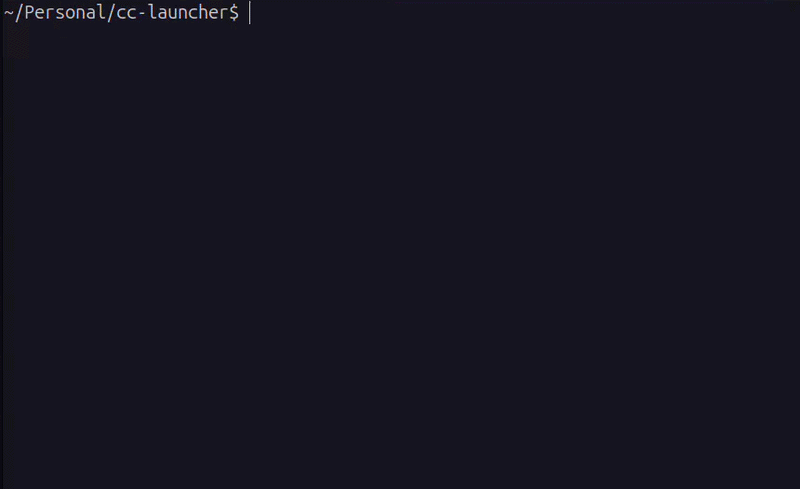

# CC Launcher




**Switch Claude Code providers instantly. No config edits required.**

Run Claude Code with any provider or API key in seconds using a simple CLI.

```bash
npx cc-launcher
```

---

## 🚀 Why CC Launcher?

Claude Code requires editing `~/.claude/settings.json` to switch providers. That process is slow, error-prone, and breaks flow.

CC Launcher solves this by:

* Injecting environment variables at runtime
* Keeping your config untouched
* Letting you switch providers with a single command

---

## ✨ Features

* 🔁 **Instant provider switching**
* 🔐 **Multiple credentials per provider**
* ⚡ **Zero config changes required**
* 🧪 **Supports local + cloud models**
* 🧰 **CLI + automation friendly**
* 🛡️ **Safe credential storage (0600 permissions)**

---

## 🔥 Common Use Cases

* Compare providers like OpenRouter, DeepSeek, Ollama
* Switch between **work and personal API keys**
* Use **cheap vs premium models** dynamically
* Toggle between **local (Ollama) and cloud APIs**
* Run Claude Code in **CI pipelines with env injection**

---

## ⚡ Quick Start

```bash
# Interactive setup
npx cc-launcher

# Pick credentials interactively and launch
npx cc-launcher launch

# Launch directly with a saved credential slug
npx cc-launcher launch zai-personal

# Pass arguments to Claude Code
npx cc-launcher launch zai-personal -- --model sonnet
```

First run takes ~10 seconds. After that, switching is instant.

---

## 🎯 Commands

| Command                        | Description                           |
| ------------------------------ | ------------------------------------- |
| `cc-launcher`                  | Interactive menu                      |
| `cc-launcher list`             | List saved credentials                |
| `cc-launcher launch`           | Pick credentials interactively        |
| `cc-launcher launch <slug>`    | Launch with specific credentials      |
| `cc-launcher launch <slug> --print` | Output env vars only             |
| `cc-launcher launch <slug> -- <args>` | Forward args to Claude Code    |
| `--credentials <slug>`         | Legacy alias for `launch <slug>`      |

---

## 🌐 Supported Providers

Works with any **Anthropic-compatible API**, including:

* OpenRouter
* DeepSeek
* z.ai
* Ollama
* LM Studio
* vLLM
* LiteLLM
* Fireworks AI
* Qwen (Alibaba)
* Cloudflare AI Gateway
* Vercel AI Gateway
* NVIDIA NIM
* and more

---

## 🧩 Add Your Own Provider

```js
export default {
  id: 'myprovider',
  name: 'My Provider',
  fields: [
    { key: 'ANTHROPIC_BASE_URL', type: 'url', required: true },
    { key: 'ANTHROPIC_AUTH_TOKEN', type: 'secret', required: true }
  ],
};
```

Register it and it appears automatically in CLI.

---

## 📁 Config

Stored at:

```
~/.claude-providers.json
```

* Permission: `0600`
* Plaintext storage (do not commit)

---

## 📦 Install

```bash
# Recommended
npx cc-launcher

# Global
npm install -g cc-launcher

# From source
git clone https://github.com/faizansf/cc-launcher.git
cd cc-launcher && npm link
```

---

## 🛠 Requirements

* Node.js 18+
* Claude Code installed (`claude` in PATH)

---

## ⭐ Why people star this repo

* Saves time every day
* Removes setup friction
* Works with major LLM providers

## 🚧 Roadmap

* Add support for custom config file location
* Enable network-based config loading via secure private sources (no public URL exposure)
* Allow centralized config distribution within trusted environments
* Improve team collaboration without sharing API keys directly

---

## 🤝 Contributing

PRs welcome. Add providers, improve UX, or suggest features.

---

## 📄 License

MIT
