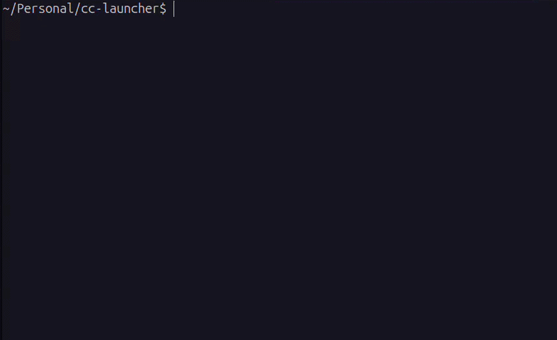

<div align="center">

# CC Launcher

*Switch Claude Code providers instantly — no config edits, no friction.*

[](https://www.npmjs.com/package/cc-launcher)
[](https://nodejs.org)
[](https://www.npmjs.com/package/cc-launcher)
[](LICENSE)

[Why](#why) • [Run Claude Code for free](#run-claude-code-for-free) • [Quick start](#quick-start) • [Commands](#commands) • [Providers](#supported-providers)



</div>

Run Claude Code with any Anthropic-compatible provider or API key in seconds. One command, zero config edits.

```bash
npx cc-launcher
```

## Why

Claude Code reads provider settings from `~/.claude/settings.json`. Switching providers normally means hand-editing that file — slow, error-prone, breaks flow.

CC Launcher injects credentials at runtime instead:

- Environment variables override settings per-launch
- Your `settings.json` stays untouched
- Switch providers with a single command or pick from a menu

## Run Claude Code for free

Anthropic's hosted Claude Code requires a paid plan or API credits. Many third-party providers ship Anthropic-compatible endpoints with **free tiers or local-only inference**, so you can run Claude Code at zero cost.

| Provider | Free option |
|----------|-------------|
| **Ollama** | Fully local — no API key, no quota, Free cloud plan available for models like GPT-OSS 120B or QWEN-3.5 |
| **LM Studio / vLLM** | Self-hosted, runs on your hardware |
| **z.ai (GLM)** | Generous coding plan available |
| **OpenRouter** | Free models (`:free` suffix) |
| **DeepSeek / Qwen / Moonshot** | Generous free credits on signup |

> [!TIP]
> Pair a local Ollama setup with CC Launcher to get an offline Claude Code workflow with no recurring cost.

## Features

- Instant provider switching from a menu or by slug
- Multiple credential sets per provider (work / personal / project)
- Zero changes to `~/.claude/settings.json`
- Works with cloud APIs and local runtimes (Ollama, LM Studio, vLLM)
- Credential file stored at `0600` permissions
- Args pass-through to `claude` for model overrides and flags
- Scriptable for CI pipelines via `--print`

## Quick start

```bash
# Interactive menu (add, edit, launch, list)
npx cc-launcher

# Pick credentials interactively, then launch claude
npx cc-launcher launch

# Launch directly with a saved credential slug
npx cc-launcher launch zai-personal

# Forward arguments to claude
npx cc-launcher launch zai-personal -- --model sonnet
```

> [!NOTE]
> First run takes ~10 seconds while `npx` fetches the package. After install, switching is instant.

## Commands

| Command | Description |
|---------|-------------|
| `cc-launcher` | Interactive menu |
| `cc-launcher list` | List saved credentials |
| `cc-launcher launch` | Pick credentials interactively, then launch |
| `cc-launcher launch <slug>` | Launch with a specific credential |
| `cc-launcher launch <slug> --print` | Print env vars and command, don't spawn |
| `cc-launcher launch <slug> -- <args>` | Forward args verbatim to `claude` |

## Use cases
- Use Claude Code free without any subscription
- Compare providers side-by-side (OpenRouter vs DeepSeek vs z.ai)
- Switch between work and personal API keys
- Toggle between cheap and premium models per task
- Run Claude Code fully offline against Ollama or LM Studio
- Inject provider env vars in CI via `--print`

## Supported providers

Works with any Anthropic-compatible API. Built-in:

OpenRouter · DeepSeek · z.ai (GLM) · Ollama · LM Studio · vLLM · LiteLLM · Fireworks AI · Qwen · Moonshot · MiniMax · Volcengine · Cloudflare AI Gateway · Vercel AI Gateway · NVIDIA NIM

## Add your own provider

Drop a file at `src/providers/<id>.js`:

```js
export default {
  id: 'myprovider',
  name: 'My Provider',
  fields: [
    { key: 'ANTHROPIC_BASE_URL', type: 'url', required: true },
    { key: 'ANTHROPIC_AUTH_TOKEN', type: 'secret', required: true }
  ],
};
```

Register it in `src/providers/index.js` and it shows up automatically in the CLI.

## Config

Two files:

- `~/.cc-launcher.json` — settings (active profile + registered profile paths). Fixed location.
- `<credentials path>` — credentials JSON, mode `0600`, plaintext. Default: `~/.cc-launcher-providers.json`. Path is driven by the active profile.

> [!WARNING]
> The credentials file holds API keys in plaintext. Don't commit it, don't sync it to public cloud storage, and review backups before sharing.

### Profiles

A profile is a label paired with a credentials file path. Each profile holds its own set of credentials — switch contexts without retyping paths or editing files.

**Common setups:**

| Profile | Credentials file | Why |
|---------|-----------------|-----|
| `default` | `~/.cc-launcher-providers.json` | Personal keys, day-to-day use |
| `office` | `~/work/.cc-launcher-work.json` | Work API keys, separate billing |
| `cheap-models` | `~/.cc-launcher-cheap.json` | Free/low-cost providers only |
| `ci` | `/etc/cc-launcher-ci.json` | Read-only path injected in CI |

**Manage profiles interactively:**

```
cc-launcher → Settings → Manage profiles
```

From there you can add, rename, change path, delete, or switch the active profile.

**CLI overrides** — one-shot, never modify saved settings:

```bash
cc-launcher --profile office launch zai          # use "office" profile this run
cc-launcher --profile office list                # list credentials from "office" profile
cc-launcher --config /tmp/test.json list         # ad-hoc path, no profile needed
```

`--profile` and `--config` are mutually exclusive.

**How it works:**

- `~/.cc-launcher.json` stores `{ activeProfile, profiles: { <label>: <path> } }`. Fixed location.
- Active profile's path drives which credentials file is read and written.
- On first run, a `default` profile pointing at `~/.cc-launcher-providers.json` is created automatically.
- Deleting the active profile is blocked — switch first, then delete.
- Profile labels are slugified (lowercase, non-alphanumerics → `-`).

**Tip:** use `--profile` in shell aliases to switch contexts without touching the active profile:

```bash
alias cc-work="cc-launcher --profile office launch"
alias cc-cheap="cc-launcher --profile cheap-models launch"
```

## Install

```bash
# Recommended — no install
npx cc-launcher

# Global install
npm install -g cc-launcher

# From source
git clone https://github.com/faizansf/cc-launcher.git
cd cc-launcher && npm link
```

## Requirements

- Node.js 18+
- Claude Code installed and on `PATH` (`claude --version` should work)

## Roadmap

- At-rest encryption for credentials files
